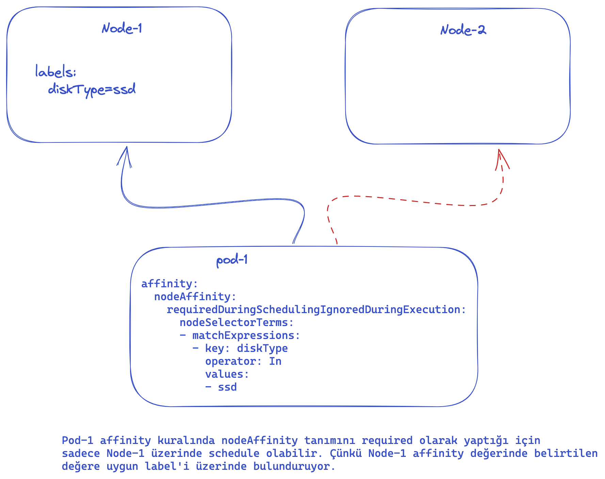
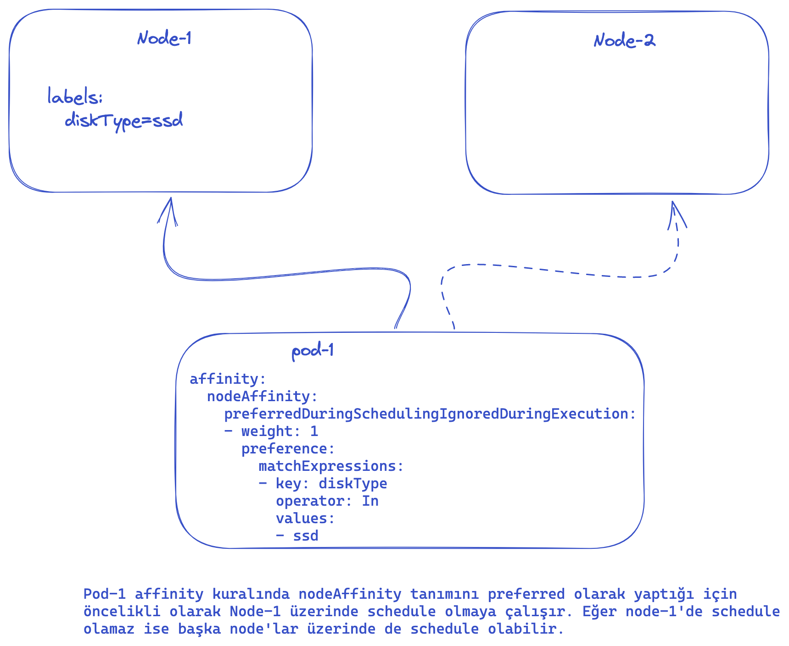
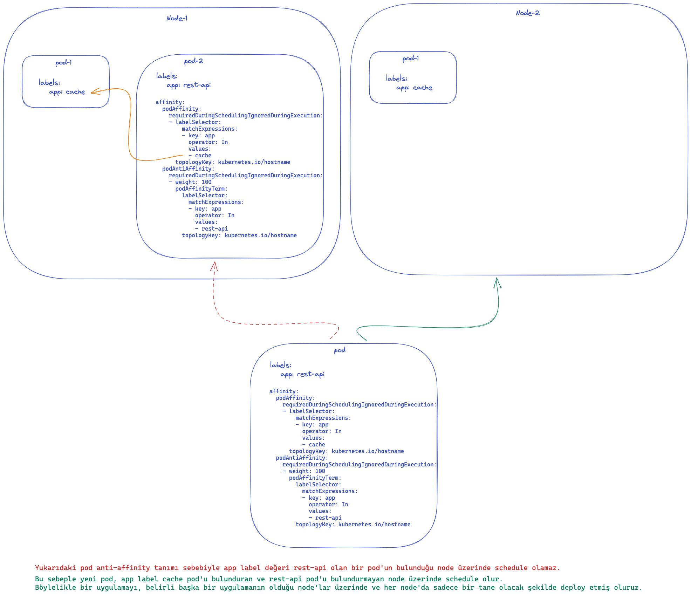

# Affinity & Anti-Affinity

Pod'ların çalışacağı node'ları belirlemek için kullanabileceğimiz bir diğer yöntem olan affinity & anti-affinity, nodeSelector yönteminden daha esnek bir yapı sağlar.

Label eşleyerek node seçmekten daha kompleks gereksinimlerde kullanılabilir.

**Bu özelliği kullanabileceğimiz bazı senaryolar**:

- Pod'larımızın belirli donanıma/lokasyona sahip node'lar üzerinde çalışmasını istersek
- Pod'larımızın belirli pod'lar ile aynı node üzerinde çalışmasını istersek
- Pod'larımızın öncelikli olarak bazı node'lar üzerinde çalışmasını, aksi durumda herhangi bir node üzerinde de çalışabilmesini istersek
- Belirli bir node grubuna aynı pod'dan birden fazla schedule edilmemesini istersek

affinity & anti-affinity özelliğini kullanabiliriz.

#### Affinity & Anti-Affinity avantajları:

- Yapılabilecek tanımlamalar nodeSelector yöntemine göre daha kapsamlıdır
- Kesin kurallar veya tercih önceliği olmasını istediğiniz kurallar yazabilirsiniz. Böylelikle schedular koşullar sağlanmadğında pod'larınızı başka bir node'a atayabilir
- Sadece node'lara göre değil, node'larda çalışan pod'lara göre de kurallar tanımlayabilirsiniz. Bu sayede birlikte çalışmasını veya çalışmamasını istediğiniz pod kuralları yazabilirsiniz

İki çeşit Affinity bulunur, `node affinity` ve `inter-pod affinity/anti-affinity`. Node affinity mevcut nodeSelector ile benzerlik gösterir ek olarak yukarıdaki ilk iki avantaja sahiptir. İnter-pod affinity/anti-affinity ise node üzerinde çalışan pod label'lerine göre kurallar yazabilmenizi sağlar.

## Node Affinity

Mevcut olarak iki tip node affinity vardır. 

**requiredDuringSchedulingIgnoredDuringExecution**: Bu affinity tipi ile scheduler'ın pod'u mutlaka bu kurala uyan bir node'a ataması zorunlu kılınır.




**preferredDuringSchedulingIgnoredDuringExecution**: Bu affinity tipi ile scheduler'ın kuralı uygulamaya çalışması fakat başarılı olamazsa pod'u başka bir node'a da atayabilmesi sağlanır.




İki affinity tipinde de bulunan **IgnoredDuringExecution** kısmı, kuralların scheduling aşamasında uygulanacağını fakat pod bir node üzerinde çalışmaya başladıktan sonra node'un label'leri değişirse o pod'u node üzerinden kaldırmayacağı anlamına gelir.

```
apiVersion: v1
kind: Pod
metadata:
  name: with-node-affinity
spec:
  affinity:
    nodeAffinity:
      requiredDuringSchedulingIgnoredDuringExecution:
        nodeSelectorTerms:
        - matchExpressions:
          - key: some-node-label
            operator: In
            values:
            - first-value
            - second-value
      preferredDuringSchedulingIgnoredDuringExecution:
      - weight: 1
        preference:
          matchExpressions:
          - key: another-node-label
            operator: In
            values:
            - another-value
  containers:
  - name: with-node-affinity
    image: k8s.gcr.io/pause:2.0
```

Yukarıdaki örnekte, pod'un sadece **some-node-label** key'i bulunan ve değeri **first-value** ya da **second-value** olan node'larda çalışabileceğini belirtir. Ayrıca bu gereksinimi karşılayan node'lar arasından **another-node-label** key'i bulunan ve değeri **another-value** olan node'ların öncelikli tercih edilmesi belirtilir.

Bu tanımda **operator** terimini görüyoruz. Node affinity tanımında `In, NotIn, Exists, DoesNotExist, Gt, Lt` gibi çeşitli operatorler kullanabiliriz. Node anti-affinity davranışını sağlamak için `NotIn, DoesNotExists` operatorlerini veya pod'ları reddetmek için node taint'lerini kullanabiliriz.

Eğer bir pod için aynı anda hem `nodeSelector` hem de `nodeAffinity` tanımlanırsa node'un bu iki kuralı birden karşılaması gerekir.

Eğer pod üzerinde `nodeAffinity` için birden fazla `nodeSelectorTerms` tanımlanırsa, bu tanımlardan bir tanesini karşılayan node'a schedule edilebilir.

Eğer pod üzerinde `nodeSelectorTerms` için birden fazla `matchExpressions` tanımlanırsa, pod sadece tüm **matchExpressions** kurallarını karşılayan node'a schedule olabilir.

Eğer pod bir node'a schedule edildikten sonra node label değerleri değişirse pod node üzerinden kaldırılmaz, çalışmaya devam eder. Diğer bir deyişle affinity kuralları sadece schedule aşamasında kullanılır, çalışma zamanını etkilemez.

`preferredDuringSchedulingIgnoredDuringExecution` altında bulunan `weight` alanı 1-100 arasında değer alır. Tüm scheduling gereksinimlerini karşılayan node'lar için scheduler bir toplam değer hesaplar ve **MatchExpressions** karşılayan node'lar için **weight** değerini toplam değere ekler. Bu işlem sonucunda en yüksek toplam değere sahip node schedule için öncelik kazanır.

## Inter-Pod Affinity & Anti-Affinity

Inter-pod affinity ve anti-affinity pod'ların node label'leri yerine o node üzerinde çalışan diğer pod'lara göre hangi node'larda çalışacağının belirlenmesini sağlar.

> Not:
>
> Inter-pod affinity ve anti-affinity büyük cluster'larda scheduling sürecini yavaşlatabilecek maliyetli hesaplamalar içerir.
> Bu sebeple birkaç yüz node'dan büyük cluster'larda kullanılması önerilmez.

> Not:
> Pod anti-affinity kuralı node'ların tutarlı bir şekilde label sahibi olmasını gerektirir. 
> Diğer bir değişle belirtilen `topologyKey`için node üzerinde uygun label bulunması beklenir. Aksi durumda beklenmedik davranış ile karşılaşılabilir.

Affinity ve anti-affinity tanımları PodSpec içerisinde **affinity** alanının altında **podAffinity** ve **podAntiAffinity** alanları ile yapılır.

Aşağıdaki örnekte affinity ve anti-affinity tanımı bulunduran bir pod bulunuyor. Bu tanımla yapılmak istenen, rest-api uygulaması sadece cache uygulamasının bulunduğu node üzerinde (affinity) ve eğer o node üzerinde başka rest-api uygulaması yok ise (anti-affinity) schedule edilmek isteniyor. Böylelikle her rest-api uygulaması mutlaka bir cache uygulamasının yanında sadece bir adet çalışacak şekilde node'lara dağıtılıyor.

Bu senaryoyu node üzerindeki uygulamaları farklı uygulamalara dedike etmek istediğinizde de uygulayabilirsiniz. Böylelikle dedike edilen uygulamanın sadece bir uygulama tarafından kullanıldığı garanti altına alınır.

```
apiVersion: v1
kind: Pod
metadata:
  name: with-pod-affinity
spec:
  affinity:
    podAffinity:
      requiredDuringSchedulingIgnoredDuringExecution:
      - labelSelector:
          matchExpressions:
          - key: app
            operator: In
            values:
            - cache
        topologyKey: kubernetes.io/hostname
    podAntiAffinity:
      requiredDuringSchedulingIgnoredDuringExecution:
      - weight: 100
        podAffinityTerm:
          labelSelector:
            matchExpressions:
            - key: app
              operator: In
              values:
              - rest-api
          topologyKey: kubernetes.io/hostname
  containers:
  - name: with-pod-affinity
    image: k8s.gcr.io/pause:2.0
```


