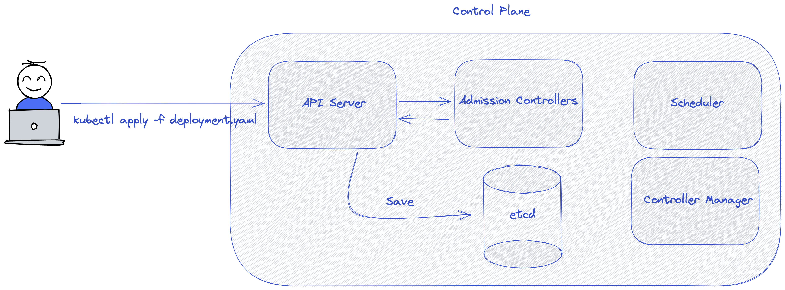

# Control Plane Elemanları

### Control Plane Nedir?

Control plane çeşitli projelerde karşımıza çıkan bir kavramdır (örneğin Istio). Bunun yanında genellikle **data plane** kavramını da görürüz. Control plane, sistemin kontrolünden, kuralların işletilmesinden, sistemin sürekliliğinin sağlanmasından sorumludur. Data plane parçalarını yönetir ve konfigüre eder.

Data plane ise control plane tarafından sağlanan kuralları işletip çalıştırmaktan sorumludur.

Kubernetes control plane kavramını "konteynırların yaşam döngüsünü tanımlamak ve yönetmek için API ve arayüzler sağlayan katman" olarak tanımlar.

# Api Server

Api server, Kubernetes'in beynidir diyebiliriz. Kubectl komutları ile cluster'a gönderdiğimiz istekler **Api Server** tarafından karşılanır. Buradan da anlayacağımız üzere Api Server gerçekten de bir web api'dan farksızdır.

Cluster içerisinde yapılan çoğu işlem Api Server üzerinden geçer.

# Etcd

Etcd cluster'ımızın tüm konfigürasyon ve resource bilgilerinin kayıt edildiği distributed key-value veritabanıdır.

# Scheduler

Scheduler, deploy ettiğimiz uygulamaların hangi node(lar) üzerinde çalıştırılması gerektiğini hesaplayıp karar veren parçadır.
Bu hesaplamayı, uygulamamızın ram ve cpu gibi kaynak gereksinimlerini ve cluster'ımızda bulunan worker node makinelerinin kullanılabilir ram/cpu değerlerini göz önüne alarak yapar.

Aynı zamanda uygulamalarımızı çeşitli kurallara göre (nodeSelector, affinity/anti-affinity, taint/toleration) farklı node'lar üzerinde çalışmasını isteyebiliriz. Scheduler bu kurallara uyan node'ların seçilmesini sağlar.

# Controller Manager

Controller uygulamalarını çalıştıran parçadır. Controller kavramı ilgili bölümde ayrıca açıklanacaktır.

Bazı controller tipleri:

- Node controller: Node'ların hata yaşama durumlarını fark etmekten ve karşılık vermekten sorumludur.
- Job controller: Job objelerinin çalıştırılmasından ve tamamlanmasından sorumludur.
- Endpoints controller: Endpoint objelerinin Service & Pod objeleri ile ilişkilendirilmesinden sorumludur.
- Service Account & Token controllers: Yeni oluşturulan namespace'ler için varsayılan service account ve API erişim token'larını oluşturur.
