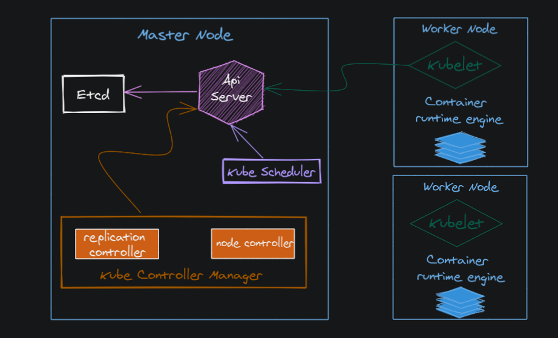

## CONTROLLER-MANAGER

Kubernetes denetleyici yöneticisi,Kubernetes ile birlikte gönderilen temel kontrol döngülerini yerleştiren bir arka plan programıdır.

Kubernetes'te bir denetleyici,kümenin paylaşılan durumunu apiserver aracılığıyla izleyen ve mevcut durumu istenen duruma getirmeye çalışan değişiklikler yapan bir kontrol döngüsüdür. Kubernetes ile birlikte gönderilen denetleyicilere örnek olarak replica denetleyicisi,endpoint denetleyicisi,namespace denetleyicisi ve servis hesapları denetleyicisi verilebilir.
