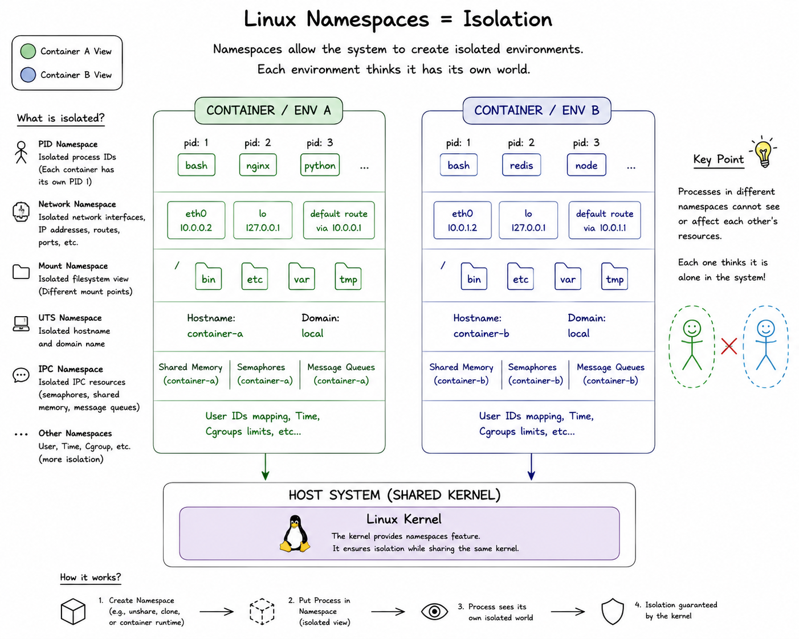

# Linux Namespaces Nedir?

Namespace tanımına gelmeden önce konteynerların hosttan ve birbirinden nasıl soyutlandığını anlamamız gerekiyor. Bunun için konteynerların temelini oluşturan **Linux Namespaces** kavramını iyi anlamamız gerekiyor. Hatırlarsanız konteynerlar temelde Linux kernelinin bir özelliğidir ve ayrıca bir virtual machine  teknolojisi değildir. Yani konteynerlar host işletim sistemi üzerinde çalışan, izole edilmiş processlerdir. Hadi gelin bunu nasıl yaptığımızı inceleyelim.

**Namespace** kelime anlamı olarak **"isim uzayı"** olarak düşünebiliriz. Yani her namespace kendi içinde process, network, mount noktaları, kaynak tüketimi, kullanıcıları gibi alanlara sahiptir. Bu alanlar sadece ilgili namespace içinde tanımlı olup diğer namespace'ler tarafından görülemezler. Bu sayede konteynerlar birbirinden soyutlanmış olur.

## Peki Soyutlama Neden Önemli?

1. **Güvenlik**: Her namespace kendi içinde izole olduğundan, bir namespace içindeki bir process diğer namespace'ler tarafından görülemez. Diğer namespace'ler veyahut hosttaki dosya sistemini, process bilgisini göremez. Bu sayede güvenlik artırılmış olur.

2. **Kaynak Yönetimi**: Namespace'ler izolasyon sağlarken, kaynak sınırlaması (CPU, RAM, I/O) **cgroups** mekanizması ile yapılır. Namespace'ler ve cgroups birlikte çalışarak her konteynerın yalnızca kendisine ayrılmış kaynakları kullanmasını garantiler. Örnek olarak Docker kullanırken bir konteynerın CPU ve RAM değerlerini belirttiğimizde, bu limitler cgroups aracılığıyla uygulanır. Bu sayede bir konteyner diğer konteynerlerin kaynaklarını tüketemez ve sistem genelinde performans korunmuş olur.

3. **Network İzolasyonu**: Her namespace kendi içinde izole olduğundan, bir namespace içindeki network arayüzleri, ip adresleri, portlar, routing tabloları diğer namespace'ler tarafından görülemez. Bu sayede namespace içindeki ağ güvenliği artırılmış olur. Örnek olarak konteyner içinde kullandığımız 80 portu diğer konteynerlerde kullanabiliriz.

## Biraz Analoji Yapalım 

Mesela bir apartmanı düşünebiliriz. Bu apartmanda birden fazla daire olsun ve hepsi birbirinden izole olsun. Her daire kendi içinde bir namespace olsun. Daireler birbirlerinin içindekileri göremezler, duyamazlar veyahut etkileyemezler. Bu dairelerin elektrik, su gibi kaynakları ayrı ayrı olsun. Bu sayede her daire kendi içinde izole olmuş olur. İşte namespace bunu yapıyor her daireyi host işletim sistemi içinde ayrı bir ortam gibi görmemizi sağlıyor. Bu sayede her bir ortam kendine özgü ve farklı dairelerden izole olmuş oluyor. Eğer namespaceler olmasaydı her daire aslında host içinde dışarıya açık ve tüm kaynaklar ortak şekilde kullanılmış olacaktı. 

## Namespaces Çeşitleri

1. **Pid Namespace**: Processlerin sahip olduğu Process idleri yani Pid değerlerini izole eder. Her namespace kendi içinde process numaralarını barındırır. Bu sayede her namespace kendi içinde  1 pid'den başlayan bir process numaralandırmasına sahiptir ve diğer namespaces'lerdeki ve hosttaki processleri görmez. 
2. **Mount Namespaces**: Mount namespace'i dosya sistemlerinin mount noktalarını izole eder. Bu sayede bir namespace içindeki mount noktaları diğer namespace'ler tarafından görülemez. ***Not: Mount tanımı ileride detaylı olarak ele alınacaktır.***
3. **Network Namespace**: Network Namespace, Linux kernelinin bir özelliğidir ve her namespace için ayrı bir ağ yığını oluşturulmasını sağlar. Bu, konteynerların kendi IP adreslerine, ağ arayüzlerine, routing tablolarına ve portlara sahip olmasını sağlar. 
4. **UTS Namespace**: UTS namespace, her namespace için ayrı bir hostname tanımlanmasını sağlar. Bu sayede her namespace kendi içinde izole olmuş olur. Örneğin konteynerıza myApp adını verdikten sonra o namespace içinde hostname komutunu çalıştırdığınızda size myApp değerini döndürecektir. Ancak bu değişiklik sadece o namespace içinde geçerlidir host da geçerli değildir.
5. **Ipc Namespace**: IPC Namespace, her namespace için ayrı bir IPC (Inter-Process Communication) kaynakları oluşturulmasını sağlar. Bu sayede bir namespace içindeki IPC kaynakları diğer namespace'ler tarafından görülemez. İşletim sistemi seviyesindeki Message Queues ve Shared Memories namespace'ler aracılığıyla izole edilmiş olur.
6. **User Namespace**: Konteyner içindeki kullanıcı ve grup ID'lerini host sistemindekilerden ayırır. (Örn: İçeride "root" olan bir kullanıcı, host makinede yetkisiz sıradan bir kullanıcı olabilir).
7. **Cgroup Namespace**: Bir process'in cgroup hiyerarşisi içindeki konumunu sanallaştıran namespace türüdür (kernel 4.6+). Kaynak limitlerini (CPU, memory, I/O) belirleyen mekanizma cgroups'un kendisidir — cgroup namespace bu limitleri değiştirmez, sadece process'in kendi cgroup path'ini nasıl gördüğünü izole eder.

## Örnek Şekil

