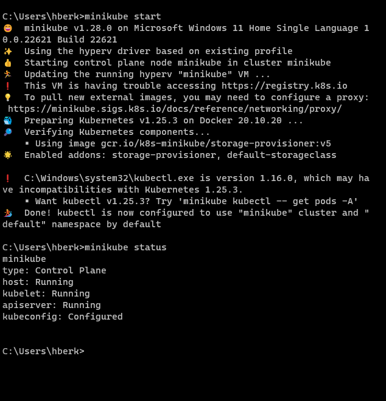
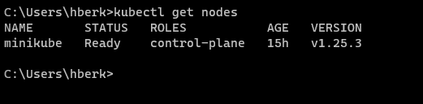
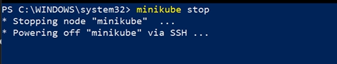
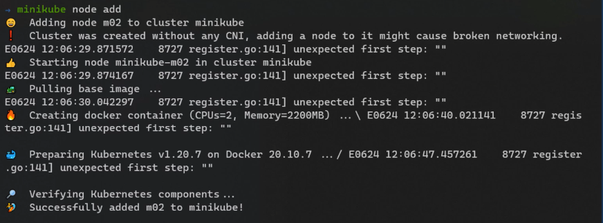

## Minikube nedir?

Minikube, bir tek düğümlü Kubernetes kümesini yerel bir bilgisayarda (genellikle geliştirme veya test amaçlı) hızlı ve kolay bir şekilde çalıştırmak için kullanılır. Minikube, kullanıcılara Kubernetes ortamını oluşturma, uygulama dağıtma ve test etme olanağı sağlar. Aynı zamanda, Minikube, farklı sürümler ve konfigürasyonlar arasında geçiş yaparak geliştiricilerin Kubernetes'in farklı özelliklerini keşfetmelerine ve denemelerine olanak tanır.

## Minikube Kurulumu
### Windows için

Windows ortamında kurulum için Chocolatey paket yöneticisini kullanabiliriz.

Power shell'i açıp aşağıdaki koduu girerek önce choco kurulumunu gerçekleştirelim.

```PS
Set-ExecutionPolicy Bypass -Scope Process -Force; [System.Net.ServicePointManager]::SecurityProtocol = [System.Net.ServicePointManager]::SecurityProtocol -bor 3072; iex ((New-Object System.Net.WebClient).DownloadString('https://community.chocolatey.org/install.ps1'))
```

ardından minikube  kurulumunu gerçekleştirebiliriz

```PS
choco install minikube
```

Tabi bu noktada şunu söylemekte fayda var Docker ,QEMU, Hyperkit, Hyper-V, KVM, Parallels, Podman, VirtualBox, veya  VMware Fusion/Workstation gibi sanallaştırma çözümlerinden birtanesinin kurulu olması gerekmekte
minikube default olarak Docker da makineleri ayağa kaldırıyor


### Macos için 

[Brew](https://brew.sh/) paket yöneticisini kullanabilirsiniz.


kurulum komutu 

```bash
brew install minikube
```


## Bir  cluster Ayağa kaldırma

```bash
# Cluster ayağa kaldırmak için aşağıdaki komutu kullanabiliriz
minikube start

# Minikube durumunu sorgulamak için aşağıdaki kodu kullana biliriz
minikube status
```
Örnek Terminal Çıktısı aşağıdaki gibi olacaktır



## Nodeların durumunu kontrol etme

minikube ayağa kalktığında otomatik olarak context'imiz güncellenmiş ve mevcut minikube clusterimiz ile iletişime geçebiliyor halde oluruz.

```bash 
kubectl get nodes
```



## Minikube Durdurma, Silme, Duraklatma


```bash 
minikube delete
```


```bash 
minikube stop
```



```bash 
#Duraklat
minikube  pause

#Devam ettir
minikube unpause

#Tüm clusterleri sil
minikube delete --all
```


## Minikube Spesifik Driver Seçimi

minikube ile çalışırken bir vm motoru seçme özgürlüğümüz mevcut. 

örneğin aşağıda bir virtualbox veya bir docker driveri ile minikube'ü başlatma örnekleri yer almakta

```bash
minikube start --driver=virtualbox
minikube start --driver=docker
```

## Ekstra nodelar ile çalışma

Başlanıgıçta minikube için  tek düğümlü bir cluster oluşturmaya yarar demiştik fakat zaman içerisinde bu yöndede bir  gelişme oldu ve artık minikube bizlere birden fazla node ekleme imkanı vermekte 

peki bunu nasıl yapıyoruz

```bash
minikube node add
```

örnek olarak terminal  çıktısı




## Eklentiler ile çalışma

minikube bütün bu yeteneklerine ek olarak eklenti desteği de sağlamaktadır. 
Örneğin test  clusterinizde bir ingress kurmak ve deneyimlemek istiyorsunuzz bu minikube  ile sanieler  içerisinde mümkün.

işte eklentiler ile çalışmak  için birkaç cli komutu

```bash
# Eklenti listesine erişme
minikube addons list

# Bir Eklentiyi  devreye alma
minikube addons enable <Eklenti_ismi>

# Başlangıçtan itibbaren bir clusteri eklenti ile  ayağa kaldırma
minikube start --addons <Eklenti_ismi> --addons <Eklenti_ismi2>


# Eklentiyi devreden çıkarma   
minikube addons disable <Eklenti_ismi>

```


