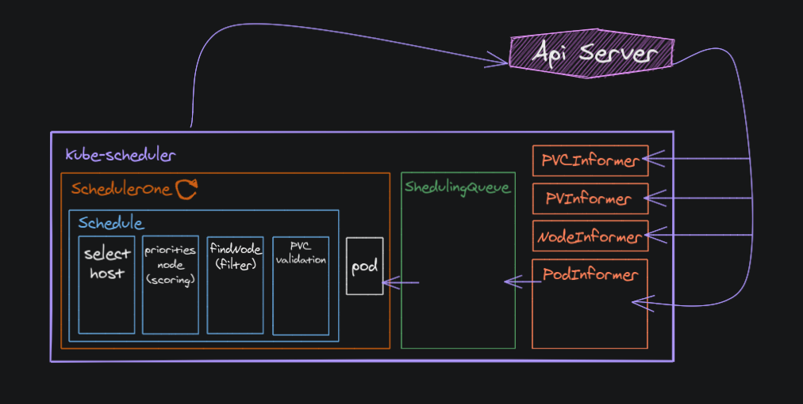

## SCHEDULER

Scheduler,clusterdaki nodeları izler, bunları bir tahmin clusterına göre filtreler, ardından her bir podun hangi nodeda zamanlanacağını belirlemek için öncelikli işlevler kulanır. Varsayılan olarak scheduler kararı node ve pod’lardaki label’ların kullanılmasıyla etkilenebilir.
