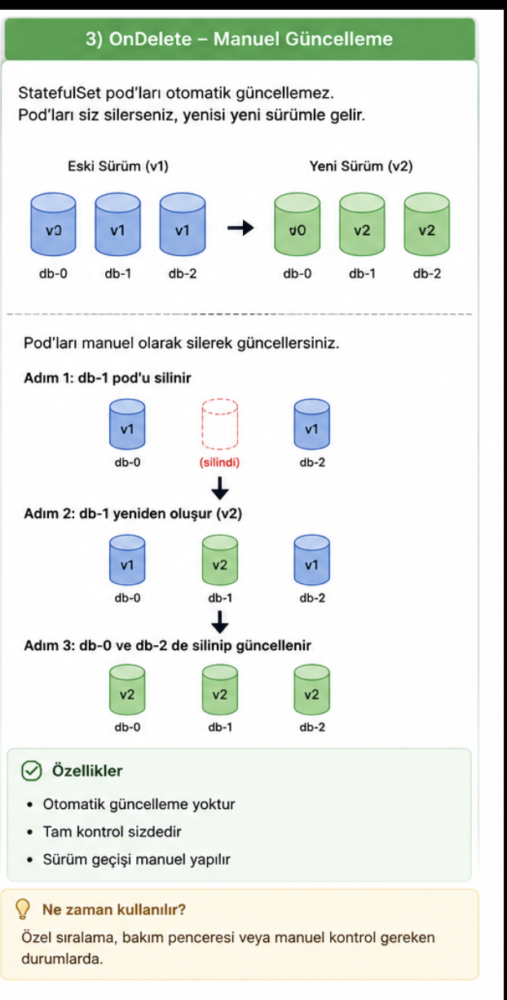
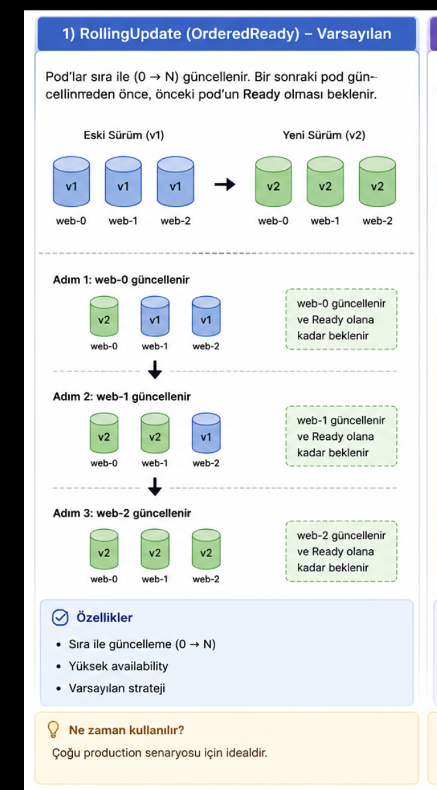
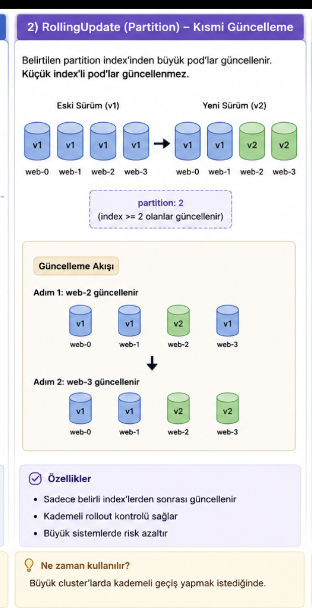

# StatefulSet

Önceki yazıda Deployment controller'ını görmüştük. Deployment, stateless uygulamalar için doğru tercih. Ancak veri tutan (stateful) uygulamalar için Deployment kullanırsak sorun yaşarız: pod silinip yeniden oluşturulduğunda hem pod'un kimliği (adı, ağ kimliği) değişir hem de veri kaybolabilir, çünkü Deployment pod'ları birbirinden bağımsız ve birbirinin yerine geçebilir (interchangeable) kabul eder.

**StatefulSet**, tam olarak bu sorunu çözmek için tasarlanmış bir controller'dır: her pod'a sabit bir kimlik ve kendine ait kalıcı depolama verir.

## StatefulSet Nedir?

StatefulSet, pod'ları **kimliği ve hafızası olan benzersiz nesneler** olarak yöneten bir controller'dır. Dört temel özelliği var:

### 1. Benzersiz ve Sabit Pod İsimleri

Deployment'ta pod isimleri rastgele bir hash alır (`web-7d8f9c9b76-x2k4p`). StatefulSet'te ise sıralı ve sabit bir isim alır:

```
NAME    READY   STATUS    RESTARTS   AGE
web-0   1/1     Running   0          2m
web-1   1/1     Running   0          90s
web-2   1/1     Running   0          40s
```

Pod silinip yeniden oluşsa da `web-1` her zaman `web-1` olarak geri gelir, ismi değişmez.

### 2. Her Pod'a Özel Kalıcı Depolama

StatefulSet, `volumeClaimTemplates` alanını kullanarak her pod için **ayrı bir PVC** oluşturur:

```yaml
volumeClaimTemplates:
  - metadata:
      name: www
    spec:
      accessModes: ["ReadWriteOnce"]
      resources:
        requests:
          storage: 1Gi
```

3 replikalı bir StatefulSet için `kubectl get pvc` çıktısı şu şekilde olur:

```
NAME          STATUS   VOLUME       CAPACITY   ACCESS MODES
www-web-0     Bound    pvc-a1b2c3   1Gi        RWO
www-web-1     Bound    pvc-d4e5f6   1Gi        RWO
www-web-2     Bound    pvc-g7h8i9   1Gi        RWO
```

Pod silinip yeniden yaratılsa da (örneğin node crash sonrası) `web-1` yine `www-web-1` PVC'sine bağlanır. Veri kaybolmaz.

### 3. Sıralı Dağıtım ve Ölçekleme

Pod'lar sırayla oluşturulur: `web-0` Running/Ready olmadan `web-1` başlatılmaz. Master-replica ilişkisinde master'ın önce ayağa kalkması gerektiği senaryolarda bu kritik önem taşır.

Kapatma sırası tersine işler: `web-2` → `web-1` → `web-0`. Eğer `web-2` terminate olduktan sonra `web-0` fail olursa, `web-1` beklemeye alınır; `web-0` tekrar Running/Ready olana kadar `web-1` kapatılmaz. Yani scale down işlemi de sıralı ve güvenli şekilde ilerler.

### 4. Headless Service ile Doğrudan Erişim

Deployment'ta pod'lara sabit bir IP atanmaz, dolayısıyla pod'lar arasında IP tabanlı doğrudan bağlantı kurulamaz. StatefulSet, bir **Headless Service** ile her pod'a sabit bir DNS adı atayarak bu sorunu çözer (detayını aşağıda görüyoruz).

## StatefulSet vs Deployment Karşılaştırması

| Özellik | Deployment | StatefulSet |
|---|---|---|
| Pod isimleri | Rastgele hash (`web-7d8f9c9b76-x2k4p`) | Sabit ve sıralı (`web-0`, `web-1`, `web-2`) |
| Pod oluşturma/silme sırası | Garanti yok, paralel | Sıralı (`OrderedReady` ile 0 → 1 → 2) |
| Depolama | Genelde tek/paylaşımlı PVC veya stateless | Her pod'un kendi PVC'si (`volumeClaimTemplates`) |
| Network kimliği | Pod yeniden oluşunca isim/IP değişir | Sabit DNS adı (Headless Service ile) |
| Scale down davranışı | Hangi pod silinir önemli değil | En yüksek ordinal'den başlayarak sırayla silinir |
| Update stratejisi | `RollingUpdate`, `Recreate` | `RollingUpdate` (ters sıralı), `OnDelete` |
| Tipik kullanım alanı | API, web sunucusu, stateless mikroservis | PostgreSQL, MySQL, Kafka, Elasticsearch, Zookeeper |

## Örnek StatefulSet YAML

Nginx tabanlı basit bir örnek üzerinden gidelim:

```yaml
apiVersion: apps/v1
kind: StatefulSet
metadata:
  name: web
spec:
  serviceName: nginx        # Headless Service'in adı
  replicas: 3
  selector:
    matchLabels:
      app: nginx
  template:
    metadata:
      labels:
        app: nginx
    spec:
      containers:
        - name: nginx
          image: nginx:1.25
          ports:
            - containerPort: 80
              name: web
          volumeMounts:
            - name: www
              mountPath: /usr/share/nginx/html
  volumeClaimTemplates:
    - metadata:
        name: www
      spec:
        accessModes: ["ReadWriteOnce"]
        resources:
          requests:
            storage: 1Gi
```

`serviceName` alanı önemli: StatefulSet'in DNS kayıtlarını hangi Headless Service üzerinden oluşturacağını belirtir.

## Pod Management Policy

StatefulSet'in pod'ları nasıl yöneteceğini belirleyen ayar:

```yaml
spec:
  podManagementPolicy: OrderedReady   # veya Parallel
```

| Policy | Pod oluşturma sırası | Bekleme davranışı | Örnek kullanım |
|---|---|---|---|
| `OrderedReady` (varsayılan) | Sıralı: 0 → 1 → 2 | Sonraki pod, öncekinin Running/Ready olmasını bekler | PostgreSQL, MySQL replikasyonu, master-replica cluster'lar |
| `Parallel` | Hepsi aynı anda | Beklemez, tüm pod'lar paralel oluşturulur/silinir | Cache node'ları, log toplayıcılar (stateless-benzeri stateful iş yükleri) |

`OrderedReady`, Postgres veya Elasticsearch gibi birbirine bağımlı node'lar için güvenlidir. `Parallel`, node'lar birbirinden bağımsız çalışıyorsa (örneğin her node kendi cache'ini tutuyorsa) daha hızlı bir dağıtım sağlar.

## Update Strategy

StatefulSet'in pod'larını güncellemek için `updateStrategy` alanı kullanılır. İki strateji var: `RollingUpdate` ve `OnDelete`.

### OnDelete

```yaml
spec:
  updateStrategy:
    type: OnDelete
```

Yeni YAML uygulandığında **hiçbir pod otomatik güncellenmez**. Bir pod, sen manuel olarak sildiğinde yeni versiyonla yeniden oluşturulur. Kontrolü tamamen sana bırakır; genelde bakım pencerelerinde manuel güncelleme yapmak isteyen sistemlerde kullanılır.



### RollingUpdate (Varsayılan)

Deployment'ta pod'lar rastgele veya karışık sırayla güncellenebilir. StatefulSet'te ise kural katıdır: **güncelleme en büyük ordinal'den en küçüğüne doğru gider.**

3 pod'lu bir Kafka cluster'ını (`kafka-0`, `kafka-1`, `kafka-2`) güncellediğimizi düşünelim:



`kafka-2` tamamen Running/Ready olmadan Kubernetes asla `kafka-1`'e dokunmaz. Amaç, cluster servisini kesintiye uğratmadan (zero-downtime) güvenli güncelleme yapmak.

### Partitioned Rolling Update

`partition` değeri verildiğinde, sadece ordinal numarası partition değerine **eşit veya büyük** olan pod'lar güncellenir; küçük olanlar eski versiyonda kalır. Bu, canary/kademeli rollout senaryoları için kullanılır.

```yaml
spec:
  updateStrategy:
    type: RollingUpdate
    rollingUpdate:
      partition: 2
```

3 replikalı bir StatefulSet'te `partition: 2` uygulandığında durum şöyle olur:



| Pod | Ordinal | `partition: 2` durumunda |
|---|---|---|
| web-0 | 0 | Eski versiyon, değişmez |
| web-1 | 1 | Eski versiyon, değişmez |
| web-2 | 2 | Yeni versiyona güncellenir |

Yeni versiyonu önce `web-2` üzerinde test edip sorun yoksa `partition` değerini kademeli olarak düşürerek (`1`, ardından `0`) diğer pod'ları da güncelleyebilirsin. Bu şekilde production'da riski azaltan bir canary rollout yapılmış olur.

## Headless Service

Headless Service, StatefulSet'in pod'larını doğrudan adresleyen bir servis türüdür. `clusterIP: None` ayarı sayesinde servis hiç ClusterIP almaz; amacı tek bir ortak IP değil, **her pod için ayrı bir DNS kaydı** oluşturmaktır.

```yaml
apiVersion: v1
kind: Service
metadata:
  name: nginx
  labels:
    app: nginx
spec:
  clusterIP: None
  ports:
    - port: 80
      name: web
  selector:
    app: nginx
```

### StatefulSet + Headless Service Nasıl Çalışır?

StatefulSet şu pod isimlendirmesini garanti eder:

```
postgres-0
postgres-1
postgres-2
```

Headless Service, bu pod'lara şu DNS adlarını verir:

```
postgres-0.postgres.default.svc.cluster.local
postgres-1.postgres.default.svc.cluster.local
postgres-2.postgres.default.svc.cluster.local
```

Bu sayede bir replica, master'ının tam olarak hangi pod olduğunu bilir ve doğrudan o adrese bağlanır. Test etmek için:

```sh
kubectl run -it --rm dns-test --image=busybox:1.28 --restart=Never -- \
  nslookup postgres-1.postgres.default.svc.cluster.local
```

## Özet: Ne Zaman Kullanmalı?

**StatefulSet kullan, eğer:**
- Uygulaman veri tutuyorsa ve pod'lar arası veri kaybı kabul edilemezse (PostgreSQL, MySQL, MongoDB, Elasticsearch, Kafka, Zookeeper)
- Pod'ların birbirini sabit bir isimle/adresle tanıması gerekiyorsa (master-replica, cluster formation)
- Her instance'ın kendine ait, pod silinse de kaybolmayan bir volume'a ihtiyacı varsa
- Pod'ların belirli bir sırayla başlaması/kapanması gerekiyorsa

**Deployment kullan, eğer:**
- Uygulaman stateless ise (API, web sunucusu, worker)
- Pod'lar birbirinden bağımsızsa, hangisinin ayakta olduğu önemli değilse
- Hızlı scale up/down ve rastgele pod oluşturma/silme sorun değilse

Kısacası: **veriyi disk üzerinde tutan ve "hangi instance" sorusunun cevabı önemli olan her uygulama için StatefulSet; geri kalan her şey için Deployment.**
