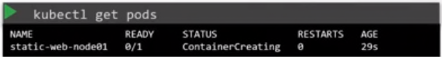

# Static Pod Nedir?

Normal şartlarda podları api-server üzerinden yönetirken, eğer ki api-server'dan bağımsız olarak worker node tarafından yönetilmesini istersek static-pod'u kullanabiliriz.

Örnek üzerinden gitmek gerekir ise, düşünün ki k8s cluster'ınızda master node devrede değil sadece bir adet worker node'unuz var ve haliyle kubelet kurulu makina üzerinde. Peki k8s api-server ayakta olmadığı için normal şartlarda pod create edememem gerekiyor, bu durumda ortaya static pod kavramı çıkıyor. Api-server'dan bağımsız kubelet'in yönetebildiği bir pod create edebiliriz.

Node ```/etc/kubernetes/manifests``` klasörünün içerisine pod definition yaml'larını koyar isek, kubelet bu podları bizim için node üzerinde ayağa kaldırır. Ayrıca bu dosyalar üzerinde bir değişiklik yapar isek yada yaml'ı siler isek, kubelet değişikliği algılar ve güncellemeyi yada pod'u silme işlemini gerçekleştirir. Pod'lar crash olması halinde otomatik olarak restart edilir.


Yukarıdaki görselde de gördüğünüz gibi kubectl üzerinden podları getirdiğimizde static podlar için pod isminin sonunda çalıştığı node'un ismi de bulunmaktadır. Peki kubelet üzerinden oluşturduğumuz pod bilgileri nasıl olduda kubectl üzerinden geldi dersek; kubelet static pod'u oluştururken mirror objeyi api-server'a da gönderir ve bu obje **sadece read only** bir objedir.

K8s kendi içerisinde master node üzerindeki scheduler, controller gibi componentleri static pod olarak çalıştırır.

Static pod ile daemonset'i karıştırmamak gerekir. Eğer k8s üzerinde static podları her node üzerinde çalıştırmak istiyorsanız, muhtemelen DaemonSet'i kullanmalısınız.
| Static Pod  | DaemonSet  |
|---|---|
| Kubelet tarafından oluşturulur  | Api-server tarafından oluşturulur(DaemonSet controller)  |
| Kontrol mekanizmalarının componentleri için kullanılır  | Node üzerindeki monitoring agentlar, log agentlar için kullanılır |
|   kube-scheduler tarafından ignore edilir   | kube-scheduler tarafından ignore edilir   |
