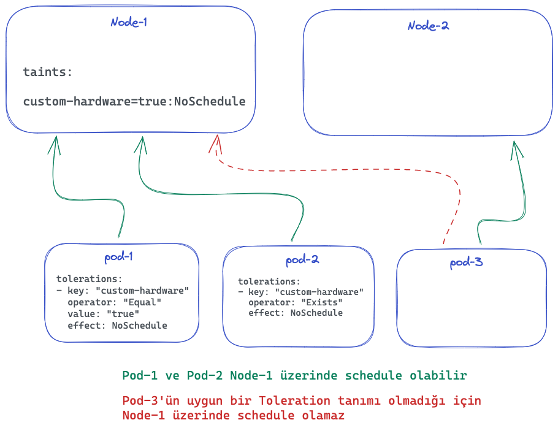
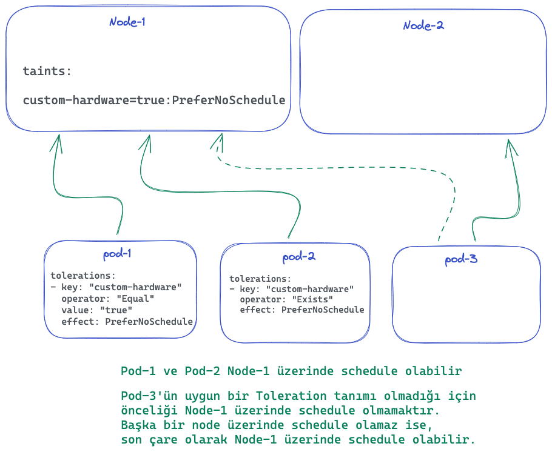
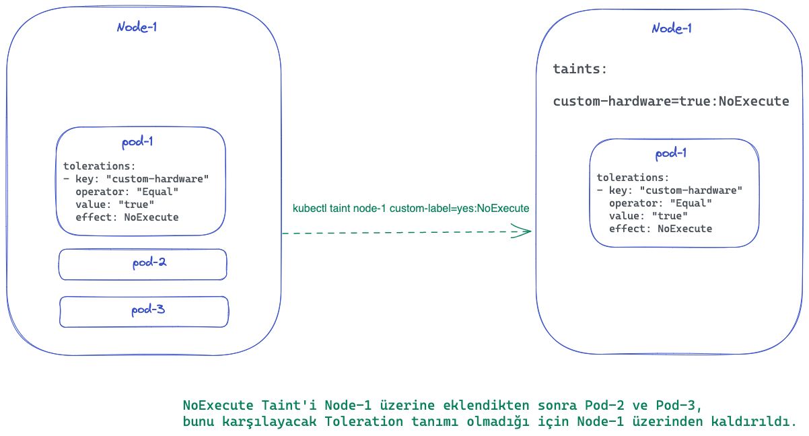
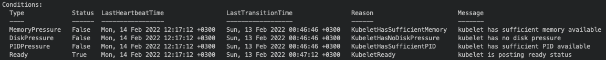

# Taint & Toleration

Taint ve Tolaretion kavramı kubernetes üzerinde belirli node’ların belirli özellikleri sağlamayan pod'ların o node'lara schedule olmasını engellemek istediğimiz zaman kullanabileceğiniz bir özelliktir.

Taint, node'lara eklenen label'lardır ve aynı isimdeki kubectl komutu kullanarak eklenir.

Tolerant ise pod'lara eklenir ve pod'un hangi taint’leri tolere ettiğini belirtir.

Peki bu özelliği hangi senaryolarda kullanabiliriz?

- Belirli node'ları sadece belirli ekiplerin/uygulamaların kullanımına sunmak istersek
- Belirli pod'lar sadece belirli donanımsal özelliklere sahip node'larda çalışsın istersek
- Bir node'da çalışan pod'ları belirli kurallara uymuyorsa o node'dan kaldırmak istersek

Taint & Toleration özelliğinden faydalanabiliriz.

Bir node için Taint tanımlaması yaparken, key-value değerleri yazarız ve sonuna Taint kuralımızı ekleriz.
Bu kural tanımladığımız Tainti karşılamayan pod'lar için ne yapılacağını belirtir.

Node'lara taint aşağıdaki kubectl komutu ile eklenir:

`kubectl taint nodes node-1 key1=value1:NoSchedule`

`kubectl taint nodes node-1 key1=value1:PreferNoSchedule`

`kubectl taint nodes node-1 key1=value1:NoExecute`

Bunlara karşılık pod'lar için oluşturulabilecek Toleration tanımı deployment/pod spec altına yazılır:

```
apiVersion: v1
kind: Pod
metadata:
  name: nginx
  labels:
    app: nginx
spec:
  containers:
  - name: nginx
    image: nginx
    imagePullPolicy: IfNotPresent
  tolerations:
  - key: "key1"
    operator: "Exists"
    effect: "NoSchedule"
````

Toleration tanımında bulunan `operator` değeri default olarak `Equal` kabul edilir.
Bir Taint ile Toleration tanımı key ve effect değeri aynı olduğunda ve:

- `operator` değeri `Exists` ise (herhangi bir value verilmediğinde)
- `opeartor` değeri `Equal` ve value değeri eşit ise

eşleşir.

>Not: 
>
>`operator` değeri `Exists` olarak tanımlandığında ve key, effect değerleri boş bırakıldığında tüm durumları tolere et anlamına gelir, tüm Taint'ler ile eşleşir.
>
>`effect` değeri boş olduğunda key değeri aynı olan tüm Taint'ler ile eşleşir.

Aşağıdaki Toleration tanımları işlev olarak aynıdır:

```
tolerations:
- key: "key1"
  operator: "Equal"
  value: "value1"
  effect: "NoSchedule"
```

```
tolerations:
- key: "key1"
  operator: "Exists"
  effect: "NoSchedule"
```


### NoSchedule

Toleration tanımı olmayan pod'ları o node’a schedule etmez.




### PreferNoSchedule

Toleration tanımı olmayan pod'ları node’a schedule etmemeyi dener, gene de pod o node’da çalışabilir.




### NoExecute

Toleration tanımı olmayan pod’ları o node’a schedule etmez, sonradan eklenen Taint’leri karşılamayan bir pod varsa o pod’u node üzerinden kaldırır.




NoExecute Taint tanımı yapılmış bir node üzerinde çalışan pod'lar deschedule edilmeden önce ilgili pod'ların belirli bir süre daha node üzerinde çalışmasını sağlayacak bir parametre bulunuyor: `tolerationSeconds`. Eğer belirtilen süre içerisinde NoExecute Taint tanımı node'dan kaldırılırsa pod'lar node üzerinde çalışmaya devam eder. Bu süre içerisinde Taint tanımını kaldırılmazsa pod'lar node üzerinden kaldırılır.


### Kubernetes Built-in Taints

Kubernetes kendi içerisinde node'lara otomatik olarak eklediği bazı built-in Taint tanımları barındırır. Bu Taint tanımlarını node'lara bazı koşullar sağlandığı zaman ekler.
Kubernetes'in bu özelliğine TaintNodesByCondition adı verilir. Bu conditionlar NodeCondition başlığı altında belirtilir.

Kubernetes cluster'ında bir node için mevcut conditionları aşağıdaki komut ile görebiliriz:

`kubectl describe nodes node-1`




Bazı node condition'lar ve karşılığında node'lara eklenen Taint'ler aşağıdaki gibidir.

##### Ready
Node healthy ve pod kabul etmeye hazır ise true değerini alır, aksi durumda false değerini alır. Eğer node controller node-monitor-grace-period (default 40 saniye) süresince node'dan haber alamadıysa Unknown değerini alır.

Eğer değer false olursa `node.kubernetes.io/not-ready` Taint'i, değer Unknown olursa `node.kubernetes.io/unreachable` Taint'i node'a eklenir.

##### OutOfDisk
Node üzerinde yeni pod eklemek için boş disk alanı kalmadıysa true değerini alır, `node.kubernetes.io/out-of-disk` Taint'i node'a eklenir.

##### DiskPressure
Node üzerindeki disk kapasitesi azaldığında true değerini alır, `node.kubernetes.io/disk-pressure` Taint'i node'a eklenir.

##### MemoryPressure
Node üzerinde memory yetersiz ise bu değer true olur ve karşılığında `node.kubernetes.io/memory-pressure` Taint'i node'a eklenir.

##### PIDPressure
Node üzerinde çok fazla process varsa ve yeni process başlatılamayacaksa bu değer true olur ve karşılığında `node.kubernetes.io/pid-pressure` Taint'i node'a eklenir.

##### NetworkUnavailable
Node network ayarları doğru konfigürasyona sahip değilse true değerini alır, `node.kubernetes.io/network-unavailable` Taint'i node'a eklenir.